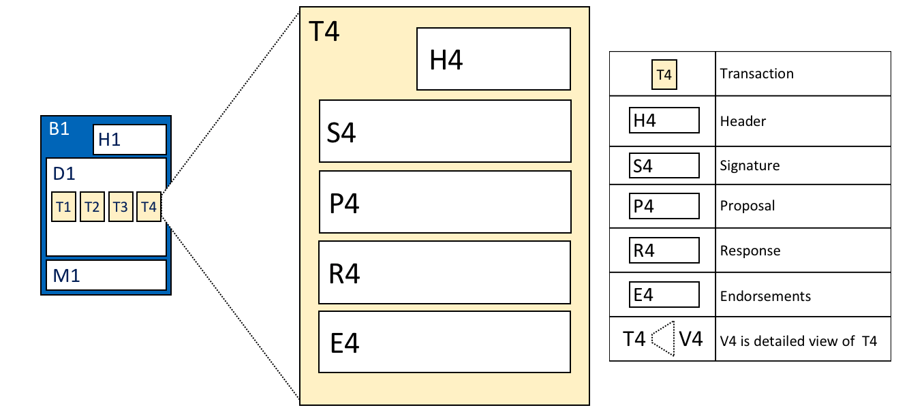

## The Ledger in Hyperledger Fabric
### Consists of two distinct, though related, parts - __world state__ and a __blockchain__

### World state
The world state is a database that holds the __current values__ of a set of ledger states.  Ledger states are, by default, expressed as __key-value__ pairs, though there is some flexability in this regard. The world state changes frequently, as states can be created, updated and deleted.  

Those states represent the states of the assets in the current network.

The world state is created because it's useful for programs to get the current value of the asset, instead of traversing the entire blockchain to calculate the current value of that asset.

Physically, the world state is implemented as a database. DBs provide a rich set of operations for the efficient storage and retrieval of states. Fabric can be configured to use different world state DBs to address the needs of different types of state values and the access patterns required by applications, for example in complex queries. Usually Fabric will use LevelDB or CouchDB(for more complex networks).

Obviously only validated transactions will be able to change the world state.

_The visual vocabulary expressed in facts is as follows: There is a ledger state with key=CAR1 and value=Audi. There is a ledger state with key=CAR2 and a more complex value {model:BMW, color=red, owner=Jane}. Both states are at version 0._

 The version number of a state is incremented every time the state changes. It's a good way to check whether the state of the asset has been updated in order to make sure it matches with the version when the transaction was created. This check ensures that the world state changing __from the same expected value to the same expected value__ as when the transaction was created.

When a ledger first is created the world state is empty. Since the transactions are recorded in the blockchain and any valid transaction  can change the world state, this means that the world state can be re-generated from the blockchain at any time. This can be very convenient - for example, the world state is automatically generated when a peer is created. Moreover, if a peer fails abnormally, the world state can be regenerated on peer restart, before transactions are accepted. 

### Blockchain 
The blockchain is with it's defining qualities - immutable sequense of blocks, each of which contains a set of ordered transactions. 

The blockchain here is represented as a transaction log that records all the changes that determine the world state. Transactions are collected inside blocks that are appendeed to the blockchain - enabling you to understand the history of changes that resulted in the current world state. 

_The visual vocabulary expressed in facts is as follows: Ledger L comprises blockchain B and World State W. Blockchain B determines World State W. Also expressed as: World state W is derived from blockchain B._

The network maintains multiple copies of the ledger - which are kept consistent with every other copy through a process called consensus. 

The blockchain is a transaction log, structured as interlinked blocks, where each block contains a sequence of transactions each of which represents a query or update to the wolrd state. The exact mechanism of how the peers are validating and then the orderer orders the valid transactions is disscussed in the peers section. It is important that block sequencing, as well as transaction sequencing within blocks, is established when blocks are first created.

Each block's header includes a hash of the block's transactions, as well as a copy of the hash of the prior block's header. In this way, all transactions on the ledger are sequenced and cryptographically linked together. This hashing and linking makes the ledger data very secure. Even if one node hosting the ledger has tamperede with, it would not be able to convince all the other nodes that it has the 'correct' blockchain because the ledger is distributed throughout a network of independent nodes. 

Physically, the blockchain is always implemented as a file, in contrast to the world state, which uses a DB. This is a sensible design choice as the blockchain data structrure is heavily biased towards a very small set of operations. Appending to the end of the blockchain is the primary operation, and query is currently a relatively infrequent operation. 

_The visual vocabulary expressed in facts is as follows: Blockchain B contains blocks B0, B1, B2, B3. B0 is the first block in the blockchain, the genesis block_

In the above diagram, we can see that block B2 has a block data D2 which contains all its transactions: T5, T6, T7.

Most importantly, B2 has a __block header__ H2, which contains a cryptographic __hash__ of all the transactions in D2 as well as with the equivalent hash from the previous block B1. In this way, blocks are inextricably and immutably linked to each other, which the term blockchain so neatly captures!

Finally, as you can see in the diagram, the first block in the blockchain is called the __genesis block__. It’s the starting point for the ledger, though __it does not contain any user transactions. Instead, it contains a configuration transaction containing the initial state of the network channel__. A little bit more about the genesis block, in more detail, will be provided in the blockchain network and channels sections.

#### Blocks and their structure

- Block Header - consists of three fields
    - Block number - an integer starting at 0 (the genesis block), and increased by 1 for every new block appended to the blockchain. 
    - Current block Hash: The hash of all the transactions contained in the current block. 
    - Previous Block Hash - A copy of the hash from the previous block in the blockchain.

_The visual vocabulary expressed in facts is as follows: Block header H2 of block B2 consists of block number 2, the hash CH2 of the current block data D2, and a copy of a hash PH1 from the previous block, block number 1._

- Block data - Contains a list of transactions arranged in order. It is written when the block is created.

- Block Metadata - contains the time when the block was written, as well as the certificate, public key and signature of the block writer. Subsequently, the block committer also adds a valid/invalid indicator for every transaction, though this information is not included in the hash, as that is created when the block is created. 

#### Transactions

_The visual vocabulary expressed in facts is as follows: Transaction T4 in blockdata D1 of block B1 consists of transaction header, H4, a transaction signature, S4, a transaction proposal P4, a transaction response, R4, and a list of endorsements, E4._

- Header - illustrated by H4 in the diagram, captures essential metadata about the transaction- for example, the name of the relevant chaincode and its version. 
- Signature  - illustrated by S4, contains a cryptographic signature, created by the client application. This __signiture__ is the __private key of the user__ who is trying to do some action on the network, a.k.a he/she makes a __transaction proposal__. This field is used to check that the transaction details have not been tampered with, as it requires the application's private key to generate it. 
- Proposal - illustrated by P4, encodes, encodes the input parameters supplied by an application to the chaincode which creates the proposed ledger update. This transaction proposal has to be verified and validated by the __endorsing peers__. When the chaincode runs, this proposal provides a set of input parameters, which, in combination with the current world state and if the transaction proposal has been verified, determines the new world state. 

- Response - illustrated by R4, captures the before and after values of the world state, as a __Read Write set__ (RW-set). It's the output of a chaincode, and if the transaction is successfully validated, it will be applied to the ledger to update the world state. 

- Endorsements - illustrated by E4, this is a list of signed transaction responses from each required organization sufficient to satify the endorsement policy. You'll notice that, whereas only one transaction response is included in the transaction, there are multiple endorsements. That's because each endorsement effectively encodes its organization's particular transaction response - meaning that there's no need to include any transaction response that doesn't match sufficient endorsements as it will be rejected as invalid, and not update the world state.  

### World State DB options

- currently can be either LevelDB (simple db) or CouchDB (complex db)
- __LevelDB__ is the default and is particularly appropriate when ledger states are simple key-value pairs. A LevelDB database is closely co-located with a network node - it is embedded within the same operating system process. 
- CouchDB is a particularly appropriate choice when ledger states are structured as JSON documents because CouchDB supports the rich queries and update of richer data types often found in business transactions. Implementation-wise, CouchDB runs in a separate operating system process, but there is still a 1:1 relation beween a network node and a CouchDB instance. All of this is invisible to chaincode. More about how CouchDB works [here](https://hyperledger-fabric.readthedocs.io/en/release-1.3/couchdb_as_state_database.html
).

#### References : 
1. https://hyperledger-fabric.readthedocs.io/en/release-1.3/ledger/ledger.html
1. https://hyperledger-fabric.readthedocs.io/en/release-1.3/txflow.html
1. https://hyperledger-fabric.readthedocs.io/en/release-1.3/couchdb_as_state_database.html
